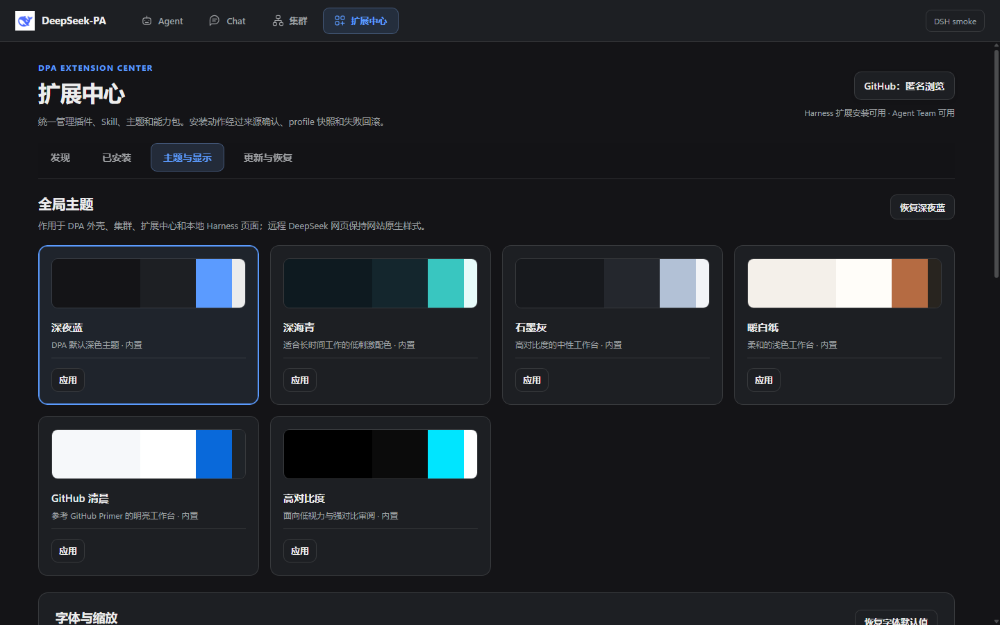

# DeepSeek-PA (DPA)

[English](README.md) | [简体中文](README.zh-CN.md)

[Windows downloads](https://github.com/ZPA76/deepseek-pa-dsh-desktop/releases) · [Installation guide](docs/INSTALL-WINDOWS.md) · [0.6.0 release notes](docs/RELEASE_NOTES-v0.6.0.md) · [Report an issue](https://github.com/ZPA76/deepseek-pa-dsh-desktop/issues)

Developer preview **0.6.0** · Windows x64 · Tested with **DSH 0.1.5-rc.2**

**An unofficial modular desktop workspace for DeepSeek Harness (DSH).**

DeepSeek-PA turns the local DeepSeek Harness ecosystem into a cohesive Windows desktop application. It keeps everyday Chat separate from task-oriented Agent work, adds a unified extension and appearance center, and provides a supervised multi-agent Cluster workspace for larger projects.

> DPA is an independent community project built on DeepSeek Harness. It is not an official DeepSeek product and does not replace the upstream DSH runtime.

> The desktop download does **not** bundle DSH. Prepare a compatible local DSH runtime and model credentials before launching; follow the [Windows installation guide](docs/INSTALL-WINDOWS.md). Download the executable or portable archive from Releases, not GitHub's automatically generated source-code archive.


> Screenshots use synthetic demo projects and fictional employee profiles. The discovery screenshot uses **75 simulated repositories** to demonstrate pagination; it is not a live search result or an endorsement of those entries. No personal account, production project, machine path, or credential data is shown.

## New in 0.6.0

- GitHub repository search with visible queries, sorting, page navigation, and 30 / 60 / 100 results per page. DPA's curated list is a separate source.
- Updated DSH credential and ACP startup compatibility; project startup checks, persistent failure feedback, duplicate-click prevention, and retry.
- A refreshed desktop workspace with clearer navigation, readable employee cards and discussions, bounded approval panels, and a compact layout that keeps task details from covering the conversation.

GitHub's Search API exposes at most the first **1,000 results per query**. DPA displays the total count and that boundary; narrow the query or open the equivalent GitHub search. Search visibility does not imply that a repository is an installable DSH extension.

## Why DPA

DeepSeek Harness is a composable agent runtime. DPA focuses on the desktop experience around that runtime: organizing different ways of working, exposing capabilities without forcing users to edit configuration files, and making multi-agent execution visible and governable.

DPA is more than a desktop wrapper and the Cluster module is only one part of the product. Its current direction combines:

- **Agent and Chat separation:** use the local DSH Agent workspace for tool-driven work while keeping ordinary DeepSeek Chat in a dedicated view.
- **Modular capability center:** discover and manage plugins, Skills, themes, fonts, backgrounds, updates, backups, and future DPA modules from one place.
- **Shared DPA appearance:** theme the shell, Cluster and Extension Center, import compatible theme definitions, adjust typography and zoom, or use an independent image background. Embedded upstream pages have [separate compatibility boundaries](#appearance-boundaries).
- **Supervised multi-agent projects:** create employee profiles, appoint a project team, discuss work visibly, execute tasks with tools, review evidence, and approve plans or deliverables.
- **Local-first operations:** preserve project events, revisions, approvals, work traces, diagnostics, and recovery data on the local machine.

## Product modules

| Module | What it provides |
| --- | --- |
| Agent | Local DSH task workspace for agents, tools, files, Shell commands, plugins and Skills. |
| Chat | A separate conversational workspace for ordinary DeepSeek Chat usage. |
| Extension Center | GitHub discovery, plugin and Skill management, themes, fonts, backgrounds, update and recovery controls. |
| Employee Center | Reusable employee-agent identities with roles, models, Skills, development history, versions and project appointments. |
| Cluster Projects | Project rooms, governance policies, public discussions, tasks, decisions, approvals, deliverables and telemetry. |
| Desktop Shell | Tray residency, global navigation, startup recovery, update-safe packaging and crash diagnostics. |

## Interface gallery

### Extension and Skill discovery

Search GitHub repositories using keywords or qualifiers such as `user:`, `topic:` and `language:`. Choose a source, sort order and page size, or open the same search on GitHub. Anonymous public browsing works without account configuration.

Account sign-in is an opt-in developer setup in 0.6.0: register your own GitHub OAuth App, enable Device Flow, set `DPA_GITHUB_CLIENT_ID`, then restart DPA. The current authorization request uses the `read:user` and `repo` scopes. The `repo` scope is broader than public browsing and can grant access to private repositories; review GitHub's consent page and stay anonymous if you do not need that access. See the [Windows installation guide](docs/INSTALL-WINDOWS.md#optional-github-account-sign-in).


Synthetic pagination demo: `demo-*` entries and their counts are test fixtures, not real catalog entries.

### Employee development

Employees are persistent, editable agent identities rather than one-off prompts. Profiles can be revised, developed through candidate configurations and evaluations, versioned, archived and appointed differently for each project. This workflow is prompt/profile development; model fine-tuning and distillation are not implemented.


### Project creation and governance

Every project selects participating employees and one of three governance policies—hierarchical, collaborative or autonomous. These policies change authority and coordination; they do not create three unrelated workflow engines.


### Visible work with human approval

The project room separates public employee discussion from work traces, tool calls, tasks, decisions, approvals and delivery records. It does not expose or fabricate hidden model reasoning. Computer-access policies include requesting approval, risk-managed automatic execution and project-scoped full access; the effective isolation also depends on the underlying runtime and tools.

### Appearance boundaries

Themes, typography and image backgrounds share settings across the DPA shell, Cluster and Extension Center. DPA can import its native themes and convert supported DSH or VS Code color-theme definitions; importing a color theme does not recreate another application's layout or extensions.



The embedded DSH Agent page retains its upstream layout. Color injection is best-effort and **does not yet cover every element in newer DSH versions**; a light Agent page can coexist with a dark DPA shell. Remote DeepSeek Chat keeps the website's original appearance.

## Cluster lifecycle

1. Create a project, define its goal and optional workspace.
2. Choose a governance policy and appoint employee agents.
3. Introduce the task in the public project discussion.
4. Let employees discuss the plan while DPA records decisions and responsibilities.
5. Review and approve the proposed plan.
6. Execute tasks through DSH tools and Skills with the selected permission level.
7. Inspect progress, tool traces, token usage and cache metrics outside the public discussion.
8. Review a structured delivery report covering completed work, discussion outcomes, risks and approval requests.
9. Accept the delivery or return it for a versioned revision.

## Reliability and privacy

DPA uses atomic snapshots, append-only project events, bounded UI buffers, idempotent updates, corrupt-state isolation and crash diagnostics. Project records are stored locally, while model requests and GitHub operations can transmit selected content to configured services. Stored GitHub tokens use operating-system-backed encryption; DPA refuses to persist them in plaintext if secure storage is unavailable.

Do not commit `DSH_HOME`, `.credentials.yaml`, user project data, logs, caches, `node_modules`, build output or `.dpa-backups`. See [SECURITY.md](SECURITY.md) and [docs/PRIVACY.md](docs/PRIVACY.md).

## Status

DPA is an active developer preview. The current source version is `0.6.0`; the tested upstream version is `DSH 0.1.5-rc.2`. Other DSH releases are not implicitly certified compatible.

Current focus areas include DSH compatibility, safe updates, richer extension discovery, employee development, project governance, global appearance, and stability under long-running workloads.

The local 0.6.0 validation included **98 regression tests**, packaged desktop interaction tests across six themes, real GitHub pagination requests, and a minimal real ACP model request. These are not a claim of multi-day stress testing or successful delivery of every real project. Read the [public validation summary](docs/VALIDATION-v0.6.0.md).

## Download and install

Open [GitHub Releases](https://github.com/ZPA76/deepseek-pa-dsh-desktop/releases), choose the desired developer preview and download its Windows setup `.exe` or portable `.zip`. Match the version in the filename and check `SHA256SUMS.txt`. If 0.6.0 assets are not listed yet, they have not been publicly published; source instructions below remain available.

The [installation guide](docs/INSTALL-WINDOWS.md) explains DSH setup, the shared credential directory, first launch, updates and troubleshooting. This preview is not commercially code-signed; Windows may display an unknown-publisher warning.

## Requirements

- Windows 10/11 x64 for packaged desktop builds.
- Node.js 22+ and npm for development.
- A prepared local [DeepSeek Harness](https://github.com/deepseek-ai/deepseek-harness) checkout/runtime and its required package manager (pnpm for the tested checkout).
- Model credentials supplied through environment variables or a user-owned DSH credentials file.

## Development quick start

```powershell
npm ci
$env:DSH_DESKTOP_HARNESS_DIR = 'C:\path\to\deepseek-harness'
$env:DSH_DESKTOP_DSH_HOME = 'C:\path\to\your\configured-dsh-home'
$env:DSH_DESKTOP_DATA_DIR = "$env:LOCALAPPDATA\DeepSeek-PA\data"
npm start
```

Replace both example paths. The DSH home must be the directory where you configured the runtime's model credentials; an empty directory will not reuse credentials stored elsewhere.

Run the quality gates:

```powershell
npm run check
npm test
npm run smoke:bridge
```

Create a packaged directory build:

```powershell
npm run sync:app-src
npm run dist:dir
```

Build output is ignored by Git. Installers and portable archives should be distributed through GitHub Releases.

## Architecture

DPA owns the desktop shell, module navigation, employee identities, cluster governance, project persistence, approval flow, appearance layer, extension discovery, update policy and recovery UX. DSH owns the underlying agent runtime, plugin composition, sessions and tools.

See [Architecture](docs/ARCHITECTURE.md), [Development guardrails](docs/DPA-DEVELOPMENT-GUARDRAILS.md) and [Update policy](docs/UPDATE_POLICY.md).

## Contributing

Bug reports, compatibility reports, design feedback, documentation improvements and pull requests are welcome. Read [CONTRIBUTING.md](CONTRIBUTING.md) first. For upstream DSH questions, use the official [DSH Discussions](https://github.com/deepseek-ai/deepseek-harness/discussions).

## License

DPA source code is available under the MIT License. DeepSeek Harness and third-party packages retain their own licenses; see [NOTICE.md](NOTICE.md).
