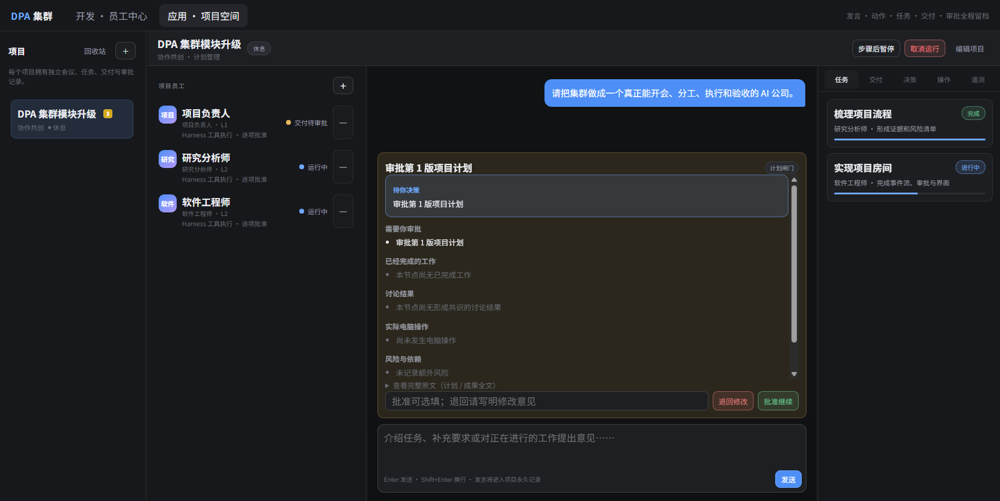
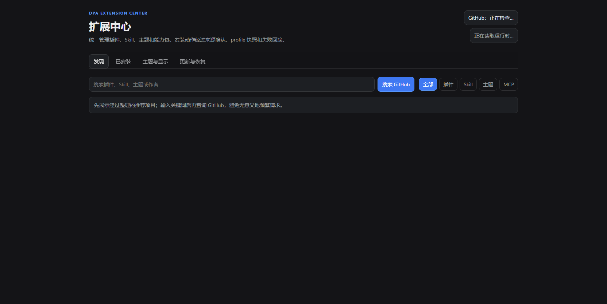
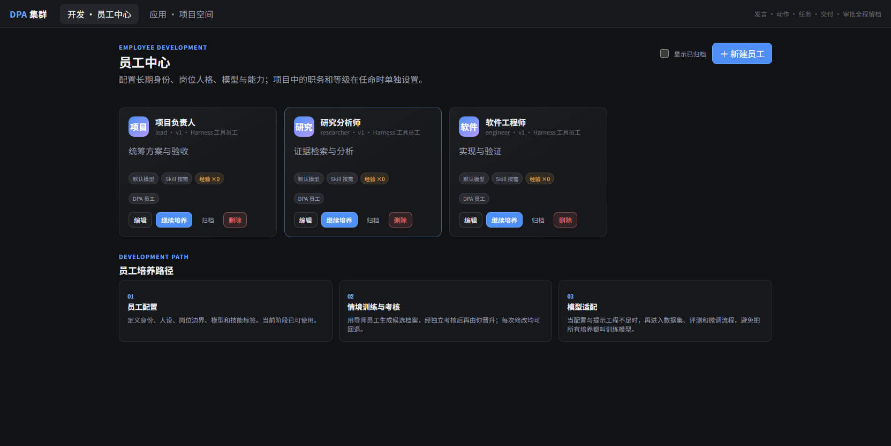
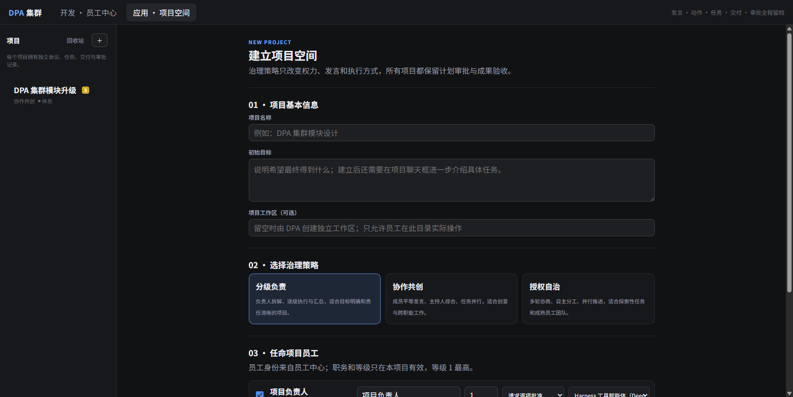

# DeepSeek-PA（DPA）

[English](README.md) | [简体中文](README.zh-CN.md)

**基于 DeepSeek Harness（DSH）构建的非官方模块化 Windows 桌面工作台。**

DeepSeek-PA 将本地 DeepSeek Harness 运行时整合为一个连贯、可定制的桌面应用：把日常对话 Chat 与工具型 Agent 工作分开，提供统一的扩展与外观中心，并通过“集群”模块支持可监督的多智能体项目协作。

> DPA 是基于 DeepSeek Harness 构建的独立社区项目，不是 DeepSeek 官方产品，也不会替代上游 DSH 运行时。



> 所有截图均使用虚构项目和演示员工数据，不包含个人账号、真实项目、本机路径或任何凭据。

## 为什么开发 DPA

DeepSeek Harness 提供了高度可组合的智能体运行时，而 DPA 关注的是围绕它建立完整的桌面使用体验：让不同工作方式各归其位，让非计算机专业用户也能通过界面发现和管理能力，并让多智能体执行过程变得可见、可控、可审批、可恢复。

DPA 不只是给 DSH 套一个桌面壳，“集群”也只是产品优势之一。当前产品方向包括：

- **Agent 与 Chat 分离：** 本地 DSH Agent 负责工具调用和任务执行，普通 DeepSeek Chat 保持独立的对话空间。
- **模块化能力中心：** 在一个界面中发现和管理插件、Skill、主题、字体、背景、更新、备份以及未来的 DPA 模块。
- **全程序外观系统：** 主题作用于整个 DPA；可以导入兼容主题、调整字体和缩放，也可以独立使用图片背景而不改变主题配色。
- **可监督的多智能体项目：** 创建可复用员工，组建项目团队，让员工公开讨论、调用工具执行、提交证据，并由用户审批计划和成果。
- **本地优先与可恢复：** 项目事件、版本、审批、工作轨迹、诊断和恢复数据优先保留在本机。

## 主要模块

| 模块 | 功能定位 |
| --- | --- |
| Agent | 面向任务执行的本地 DSH 工作区，可使用智能体、文件、Shell、插件、工具和 Skill。 |
| Chat | 与 Agent 分离的普通 DeepSeek 对话空间，避免闲聊与项目执行记录混杂。 |
| 扩展中心 | GitHub 浏览、插件与 Skill 管理、主题、字体、图片背景、更新与恢复。 |
| 员工中心 | 可复用员工身份，包含角色、模型、Skill、培养记录、版本和项目任命。 |
| 集群项目 | 项目空间、治理策略、公开讨论、任务、决策、审批、交付和遥测。 |
| 桌面外壳 | 统一导航、托盘常驻、启动恢复、安全更新封装和崩溃诊断。 |

## 界面展示

### 扩展、Skill 与主题发现

扩展中心统一管理插件、Skill、主题和 MCP 等能力。GitHub 支持匿名浏览，也可以登录账号获得更高查询额度和账号相关功能。



### 员工设计与持续培养

员工不是一次性提示词，而是能够长期维护的智能体身份。用户可以编辑员工配置、记录培养过程、建立候选版本、考核晋升、回退版本、归档员工，并在不同项目中赋予不同职责和等级。



### 建立项目与选择治理策略

创建项目时选择参与员工以及分级负责、协作共创或授权自治三种治理策略。治理策略只改变权限、决策和协作方式，所有项目仍然共用一致的生命周期、审批和交付逻辑。



### 公开讨论与人工审批

项目聊天框只展示用户和员工围绕项目的公开讨论；思考过程、工具调用、电脑操作、任务、决策、遥测和错误诊断进入独立视图。员工的电脑访问权限可以设置为：

- 逐项请求批准；
- 风险托管自动执行；
- 仅在项目工作区内完全访问。

## 集群项目完整流程

1. 建立项目，填写目标并可选指定独立工作区。
2. 选择治理策略和参与项目的员工。
3. 用户在项目讨论中介绍任务、限制和期望成果。
4. 员工公开讨论方案，DPA 记录决策、职责和风险。
5. 系统整理项目计划并提交用户审批。
6. 审批通过后，员工依据权限调用 DSH 工具和 Skill 执行任务。
7. 用户可在独立视图查看任务进度、工具轨迹、电脑操作、Token 与缓存指标。
8. 完成后生成分级交付报告，区分已完成工作、讨论结论、风险以及需要用户审批的事项。
9. 用户接受成果，或退回并形成新的版本化返工任务。

## 稳定性与隐私

DPA 使用原子快照、追加式项目事件、有限前端缓存、幂等更新、损坏状态隔离和崩溃诊断，降低长时间运行、缓存增长或异常中断造成的数据损坏风险。

项目数据和 GitHub 凭据保存在本机；在系统支持时，凭据由操作系统加密。请勿将 `DSH_HOME`、`.credentials.yaml`、用户项目、日志、缓存、`node_modules`、构建产物或 `.dpa-backups` 提交到 GitHub。详见 [安全说明](SECURITY.md) 与 [隐私说明](docs/PRIVACY.md)。

## 当前状态

DPA 目前处于积极开发的预览阶段，源码版本为 `0.5.1`。DeepSeek Harness 本身也在快速迭代，不同候选版本之间可能出现兼容性变化。

当前重点包括 DSH 版本兼容、安全更新、扩展发现、员工培养、项目治理、全局外观以及长时间高负载运行下的稳定性。

## 开发环境

- Windows 10/11 x64；
- Node.js 22+ 与 npm；
- 本地 [DeepSeek Harness](https://github.com/deepseek-ai/deepseek-harness) 源码或兼容运行时；
- 通过环境变量或用户自己的 DSH 凭据文件提供模型认证。

## 从源码运行

```powershell
npm install
$env:DSH_DESKTOP_HARNESS_DIR = 'C:\path\to\deepseek-harness'
$env:DSH_DESKTOP_DSH_HOME = "$env:LOCALAPPDATA\DeepSeek-PA\dsh-home"
$env:DSH_DESKTOP_DATA_DIR = "$env:LOCALAPPDATA\DeepSeek-PA\data"
npm start
```

运行语法检查和自动测试：

```powershell
npm run check
npm test
```

生成目录版桌面程序：

```powershell
npm run sync:app-src
npm run dist:dir
```

构建产物不会提交到普通源码历史，安装包和便携版应通过 GitHub Releases 发布。

## DPA 与 DSH 的关系

DPA 负责桌面外壳、模块导航、员工身份、集群治理、项目持久化、审批流程、外观系统、扩展发现、更新策略和恢复体验；DSH 负责底层智能体运行时、插件组合、会话和工具。

详细说明见 [架构文档](docs/ARCHITECTURE.md)、[开发护栏](docs/DPA-DEVELOPMENT-GUARDRAILS.md) 和 [更新策略](docs/UPDATE_POLICY.md)。

## 参与项目

欢迎提交 Bug、DSH 兼容性报告、设计建议、文档改进和 Pull Request。参与前请阅读 [贡献指南](CONTRIBUTING.md)。DSH 本体相关问题请前往官方 [DeepSeek Harness Discussions](https://github.com/deepseek-ai/deepseek-harness/discussions)。

## 许可证

DPA 源代码使用 MIT License。DeepSeek Harness 和第三方依赖保留其各自许可证，详见 [NOTICE.md](NOTICE.md)。